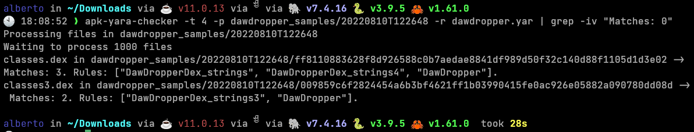

# apk-yara-checker
'apk-yara-checker' is a little CLI tool written in Rust to check Yara rules against a folder of APK files.
You have to pass the folder (or APK file) to check your Yara rules (param -p) and the '.yar' file of your Yara ruleset (param -r).

The different parameters you can use to run apk-yara-checker are:
```
APK Yara checker 0.1

USAGE:
    apk-yara-checker [OPTIONS] -p <path> -r <rules>

FLAGS:
    -h, --help       Prints help information
    -V, --version    Prints version information

OPTIONS:
    -x <extensions>        File extensions inside APK to check rules (ej: -x dex,so,png). Use -x "*" to scan all files
                           inside APK
    -p <path>              Path to folder which contains files to check
    -r <rules>             Yara rule(s) file (.yar)
    -t <threads>           Threads
```
Parameter -x can be used to filter what files inside the APK files are checked agaisnt the Yara rules. By default it will check
.dex and .so files.

Example of usage agaisnt a folder with 1,000 APK files:

